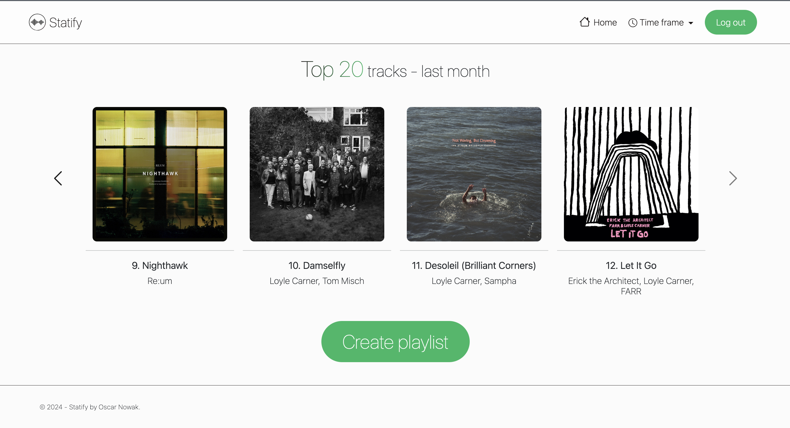

# Statify

Statify is a web application that connects with the Spotify API to display your top tracks, favourite artists, genres, and allows you to create playlists from this data. It's built using Flask for the backend, with HTML, CSS, and JavaScript for the front-end. This application was made as a CS50 final project.

## Table of Contents

- [Features](#features)
- [Technologies Used](#technologies-used)
- [Prerequisites](#prerequisites)
- [Usage](#usage)
- [API Endpoints](#api-endpoints)
- [In-depth description](#in-depth-description)
  - [.py files](#py-files)
  - [.js files](#js-files)
  - [.html files](#html-files)
  - [.css files](#css-files)
  - [Additional files](#additional-files)

## Features

- **Login with Spotify:** Log in securely using Spotify's OAuth 2.0 authentication.

- **View Favourite Tracks:** See your top 20 most played tracks over different time frames.

- **View Favourite Artists:** Get insights into your top 20 most listened to artists.

- **View Favourite Genres:** Analyze the genres of the artists you listen to most.

- **Create Playlists:** Automatically generate a playlist of your top 20 tracks and save it to your Spotify account.

- **Session Management:** Manages access token securely with refresh token functionality for seamless interaction.

## Technologies Used

- **Backend:** Flask (Python)

- **Frontend:** HTML, CSS, JavaScript

- **Spotify API:** For fetching user data (tracks, artists, playlists)

- **OAuth 2.0:** For Spotify login and authentication.

- **Sessions:** Flask Session for managing user sessions

## Prerequisites

Before you begin, ensure you have met all the following requirements:

- **Spotify Developer Account:** You will need to register your app on [Spotify Developer Dashboard](https://developer.spotify.com/dashboard).

- **Python:** You must have Python 3 installed.

- **Flask & Flask-Session:** Install these libraries in your environment.

- **Dotenv:** For managing environment variables like API keys.

## Usage

- **Run the Flask Application:** To start the application run the following command:

      flask run

  and if you would like to see the live changes made to the code run:

      flask run --debug

- **Login with Spotify**: After accessing the login page, click the login button to be redirected to Spotify's login page.
- **View Top Data:** After logging in, you'll see options to view your top tracks, artists, and genres.
- **Create Playlists:** Once your data is fetched, you can generate a playlists based on your top tracks, which will be automatically added to your Spotify's account.
- **Logout:** Log out at any time to clear your session.

## API Endpoints

- **GET /:** Homepage, redirects to login if the user is not authenticated.

- **GET /login:** Redirects to Spotify's OAUTH page for authentication.

- **GET /callback:** Spotify redirects here after successful authentication, and access tokens are stored.

- **GET /favourite-tracks:** Displays the user's top 20 most played tracks.

- **GET /favourite-artists:** Shows the user's top 20 most listened to artists.

- **GET /favourite-genres:** Displays the user's top genres based on their top artists.

- **POST /create-playlists:** Creates a playlist of the user's top tracks.

# In-depth description

### .py files

- **app.py:** This file contains the main backend logic for the web application, which integrates with the Spotify API to manage user authentication and retrieve user data such as favorite tracks, artists, and genres. It uses the Flask framework to handle HTTP requests and maintain user sessions.

  The file imports necessary libraries, including **requests** for making HTTP requests, **os** for accessing environment variables, **dotenv** for managing environment variables like API keys, **Flask-related** modules for handling web application logic, **urllib.parse** for the urlencode - encoding sequences of key value pairs into a URL query string, **datetime** for acquiring the current date and time, and **json** for working with JSON data.

  The app.py file defines all the important constants. Some, like **SPOTIFY_CLIENT_ID**, are imported from the .env file, while the rest are frequently used URLs, **SPOTIFY_AUTH_URL** for example.

  The remaining code consists of endpoints, with their functionality described in the **API Endpoints** section above. The function decorators used before most endpoints, such as **@token_required** and **@time_range_required**, are declared in the spotify_api.py file and are described in the next section.

- **spotify_api.py:** This file contains several custom functions designed to simplify working with the Spotify API.

  **get_auth_header** Takes an API token as input and returns the required header for making calls to the Spotify API.

  The **token_required** decorator checks if an access token is present and unexpired in the session. If there is no access token, it redirects to the login page (/login). If the token has expired, it redirects to a token refresh endpoint (/refresh-token). If the access token is valid, the decorated function proceeds as usual.

  The **time_range_required** decorator is applied before most API calls to check if a time range has been provided. This ensures the app can display data for the specified timeframe accurately.

  Finally the **set_displayed_time_range** function is responsible for providing the correct time range to be displayed in the HTML templates, ensuring that the data shown matches the selected timeframe.

### .js files

The javascript files can be found in the **static/scripts** folder.

- **playlist_button_change.js:** This script dynamically changes the "Create Playlist" button to a "View Playlist" button once the playlist is successfully created, without reloading the page. It also displays a loading spinner and loading message while the playlist is being created. The button can be found in favourite-tracks.html file.

- **typewriter_effect.js:** This script is responsible for the "typewriter" effect on the login page.

- **utils.js:** This file contains utility scripts that enhance the user experience by improving page transitions and enabling dynamic interaction. The first script displays a loading spinner during page transitions. The second script handles time-frame selection without requiring a full page reload.

### .html files

The HTML templates can be found in the **static/templates** folder.

- **favourite-artists.html:** Displays the user's top artists.

- **favourite-genres.html:** Displays the user's top genres in a chart. Chart was made with the [chart.js](https://www.chartjs.org/) library. It also contains a javascript code responsible for displaying the chart, and the chart styling.

- **favourite-tracks.html:** Displays the user's top tracks along with an option to create playlists.

- **homepage.html:** The main page of the application where users can choose the type of statistics they want to display.

- **layout.html:** This is the base template from which other templates are extended. It includes the page navbar and footer.

- **login.html:** The login page of the application, displayed when the user opens the app for the first time.

### .css files

- **favourite_artists_styles.css:** This file contains specific styling for the favourite artists template, for example,including adjustments to the size of the carousel images.

- **favourite_genres_styles.css:** This file describes the container in which the genres chart is placed. The style of the chart itself is included in the **favourite-genres.html** file.

- **favourite_tracks_styles.css:** This file contains specific styling for the favourite tracks template, for example, including styles for the create playlist button.

- **favourite_styles.css:** This file includes styling shared among all **favourite-...** templates.

- **login_styles.css:** This file is responsible for styling the **login.html** template. It also describes the appearance of the typewriter effect included in the **typewriter_effect.js** file.

- **styles.css:** This file contains styling shared among all templates. It includes styling for elements such as navbar, footer and spinners.

### Additonal files

- You can find the app's logo **LOGO.png** in the **static/images** folder.

- You can find the carousel custom icons **carousel-next-icon.svg** and **carousel-prev-icon.svg** in the **static/svgs** folder.
